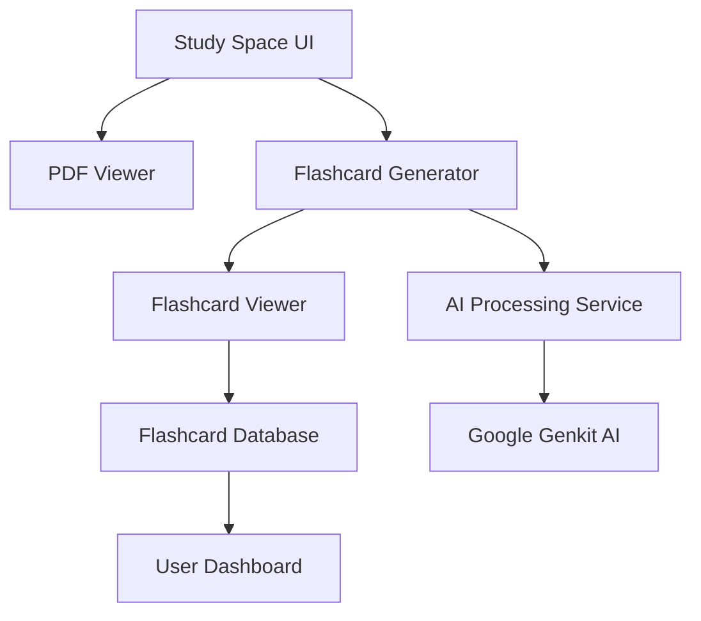

# Design Document

## Overview

The AI-powered PDF flashcards system integrates directly into the existing Study Space interface, providing seamless flashcard generation and interaction without disrupting the current study workflow. The system leverages the existing Google Genkit AI pipeline for content processing and follows the established shadcn/ui design patterns for consistency.

## Architecture

### High-Level Architecture



### Component Hierarchy

```
StudySpace
├── PDFViewer (existing)
├── FlashcardGenerator
│   ├── GenerationProgress
│   └── GenerationControls
└── FlashcardViewer
    ├── FlashcardDisplay
    ├── NavigationControls
    └── ActionButtons
```

## Components and Interfaces

### 1. FlashcardGenerator Component

**Purpose:** Handles AI-powered flashcard generation from PDF content

**Props Interface:**
```typescript
interface FlashcardGeneratorProps {
  pdfText: string;
  pdfTitle: string;
  taskId: string;
  onToggleView: () => void;
  onFlashcardsGenerated: (flashcards: Flashcard[]) => void;
}
```

**Key Features:**
- Progress indicator during AI processing
- Error handling with user-friendly messages
- Integration with existing Google Genkit AI pipeline
- Automatic text extraction and chunking for optimal AI processing

### 2. FlashcardViewer Component

**Purpose:** Interactive flashcard display and navigation

**Props Interface:**
```typescript
interface FlashcardViewerProps {
  flashcards: Flashcard[];
  onCardAction: (cardId: string, action: CardAction) => void;
  onSaveFlashcards: () => void;
  onBackToPdf: () => void;
}
```

**Key Features:**
- Swipeable card interface with touch and keyboard support
- Smooth flip animations using CSS transforms
- Real-time action feedback (save, known, review)
- Progress tracking and navigation controls

### 3. FlashcardDisplay Component

**Purpose:** Individual flashcard rendering with flip functionality

**State Management:**
```typescript
interface FlashcardState {
  isFlipped: boolean;
  currentIndex: number;
  cardActions: Record<string, CardAction>;
}
```

## Data Models

### Flashcard Model

```typescript
interface Flashcard {
  id: string;
  front: string; // Question/Prompt (max 100 chars)
  back: string;  // Answer/Explanation (max 200 chars)
  pageNumber?: number;
  sourceText?: string; // Context snippet (max 300 chars)
  confidence?: number; // AI confidence score
  createdAt: Date;
}
```

### SavedFlashcard Model (Database)

```typescript
interface SavedFlashcard {
  _id: ObjectId;
  userId: ObjectId;
  taskId: string;
  pdfTitle: string;
  question: string;
  answer: string;
  pageNumber?: number;
  sourceText?: string;
  status: 'saved' | 'known' | 'review';
  createdAt: Date;
  lastReviewed?: Date;
  reviewCount: number;
}
```

### AI Processing Pipeline

```typescript
interface AIProcessingRequest {
  text: string;
  maxCards: number;
  difficulty?: 'basic' | 'intermediate' | 'advanced';
}

interface AIProcessingResponse {
  flashcards: Flashcard[];
  processingTime: number;
  confidence: number;
}
```

## AI Processing Strategy

### Text Chunking Algorithm

1. **Document Segmentation:** Split PDF text into logical chunks (1000-1500 characters)
2. **Concept Extraction:** Identify key terms, definitions, and important concepts
3. **Context Preservation:** Maintain source references and page numbers
4. **Quality Filtering:** Remove low-confidence or redundant flashcards

### AI Prompt Engineering

```typescript
const FLASHCARD_GENERATION_PROMPT = `
Generate concise flashcards from the following text. Each flashcard should:
- Have a clear, specific question (max 100 characters)
- Provide a brief, accurate answer (max 200 characters)
- Focus on key concepts, definitions, or important facts
- Be suitable for memorization and quick review

Text: {textChunk}

Generate 2-3 high-quality flashcards in JSON format.
`;
```

## User Interface Design

### Visual Design Principles

1. **Minimalist Approach:** Clean, distraction-free interface focusing on content
2. **Consistent Styling:** Follow existing shadcn/ui patterns and color scheme
3. **Responsive Design:** Optimized for desktop, tablet, and mobile devices
4. **Accessibility First:** Proper ARIA labels, keyboard navigation, and screen reader support

### Layout Structure

```
┌─────────────────────────────────────┐
│ Study Space Header                  │
│ [PDF View] [Flashcard View] Toggle  │
├─────────────────────────────────────┤
│                                     │
│         Flashcard Display           │
│    ┌─────────────────────────┐      │
│    │                         │      │
│    │      Question Side      │      │
│    │                         │      │
│    └─────────────────────────┘      │
│                                     │
│  [Previous] [Flip] [Next]           │
│  [Save] [Known] [Review Later]      │
│                                     │
│  Progress: 3 of 10                  │
└─────────────────────────────────────┘
```

### Animation and Transitions

- **Card Flip:** 3D CSS transform with 300ms duration
- **Navigation:** Smooth slide transitions between cards
- **Action Feedback:** Subtle scale and color changes for button interactions
- **Loading States:** Skeleton loaders during AI processing

## API Design

### Flashcard Generation Endpoint

```typescript
POST /api/study/generate-flashcards
{
  text: string;
  title?: string;
  taskId: string;
  maxCards?: number;
}

Response:
{
  success: boolean;
  flashcards: Flashcard[];
  processingTime: number;
}
```

### Flashcard Storage Endpoint

```typescript
POST /api/study/save-flashcards
{
  flashcards: SavedFlashcard[];
  taskId: string;
}

Response:
{
  success: boolean;
  savedCount: number;
}
```

### Saved Flashcards Retrieval

```typescript
GET /api/study/saved-flashcards?taskId={id}&status={status}

Response:
{
  success: boolean;
  flashcards: SavedFlashcard[];
  totalCount: number;
}
```

## Migration Strategy

### Existing System Cleanup

Before implementing the new PDF-integrated flashcard system, the existing standalone flashcard system must be completely removed to avoid conflicts and confusion.

**Components to Remove:**
- `src/lib/models/flashcard.ts`
- `src/lib/services/flashcard-service.ts`
- `src/hooks/use-flashcards.ts`
- `src/app/api/flashcards/` (entire directory)
- `src/components/study/flashcards/` (entire directory)
- `src/app/dashboard/flashcards/` (entire directory)
- `src/components/dashboard/flashcard-widget.tsx`

**Database Collections to Clean:**
- Remove or rename existing `flashcards` collection
- Remove any flashcard-related indexes
- Clean up any orphaned flashcard data

**Integration Cleanup:**
- Remove flashcard references from dashboard navigation
- Remove flashcard widgets from dashboard components
- Clean up any flashcard-related imports and unused code

## Integration Points

### Study Space Integration

1. **View Toggle:** Seamless switching between PDF and flashcard views
2. **State Persistence:** Maintain study session state across view changes
3. **Progress Tracking:** Integration with existing gamification system
4. **Timer Integration:** Flashcard study time contributes to overall study duration

### Dashboard Integration

1. **Saved Flashcards Section:** New dashboard widget for accessing saved cards
2. **Progress Analytics:** Flashcard review statistics in study analytics
3. **Quick Access:** Recent flashcards and review reminders

## Error Handling

### AI Processing Errors

1. **Timeout Handling:** 30-second timeout with graceful fallback
2. **Content Validation:** Ensure generated content meets quality standards
3. **Fallback Strategies:** Manual flashcard creation option if AI fails
4. **User Communication:** Clear error messages with suggested actions

### Data Persistence Errors

1. **Network Failures:** Offline storage with sync when connection restored
2. **Database Errors:** Retry logic with exponential backoff
3. **Validation Errors:** Client-side validation with server-side verification

## Performance Considerations

### Optimization Strategies

1. **Lazy Loading:** Load flashcards on-demand to reduce initial load time
2. **Caching:** Cache generated flashcards for quick re-access
3. **Debouncing:** Prevent multiple simultaneous AI requests
4. **Progressive Enhancement:** Core functionality works without JavaScript

### Memory Management

1. **Component Cleanup:** Proper cleanup of event listeners and timers
2. **State Optimization:** Minimize re-renders with React.memo and useMemo
3. **Image Optimization:** Lazy load any visual elements

## Testing Strategy

### Unit Testing

1. **Component Testing:** Test flashcard generation, display, and interactions
2. **API Testing:** Validate all endpoints with various input scenarios
3. **Utility Testing:** Test text processing and AI integration functions

### Integration Testing

1. **End-to-End Flows:** Complete user journey from PDF upload to flashcard saving
2. **Cross-Browser Testing:** Ensure compatibility across major browsers
3. **Mobile Testing:** Validate touch interactions and responsive design

### Performance Testing

1. **Load Testing:** Test with large PDF documents and multiple concurrent users
2. **AI Response Time:** Ensure flashcard generation meets performance requirements
3. **Memory Usage:** Monitor for memory leaks during extended use

## Security Considerations

### Data Protection

1. **User Content:** Secure handling of PDF content and generated flashcards
2. **API Security:** Proper authentication and authorization for all endpoints
3. **Input Validation:** Sanitize all user inputs to prevent injection attacks

### Privacy

1. **Data Retention:** Clear policies on how long flashcard data is stored
2. **User Control:** Allow users to delete their flashcard data
3. **AI Processing:** Ensure user content is not stored by AI service providers

## Accessibility Features

### Keyboard Navigation

- **Arrow Keys:** Navigate between flashcards
- **Space/Enter:** Flip current flashcard
- **Tab Navigation:** Accessible button focus order
- **Escape:** Return to PDF view

### Screen Reader Support

- **ARIA Labels:** Descriptive labels for all interactive elements
- **Live Regions:** Announce flashcard content changes
- **Semantic HTML:** Proper heading structure and landmarks

### Visual Accessibility

- **High Contrast:** Ensure sufficient color contrast ratios
- **Focus Indicators:** Clear visual focus indicators for keyboard users
- **Text Scaling:** Support for browser zoom up to 200%